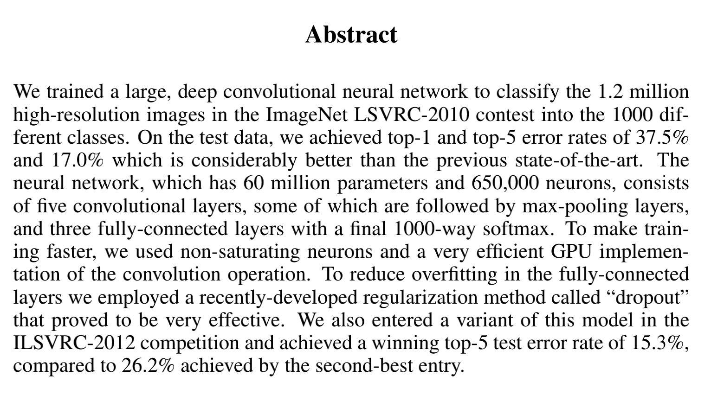

# Potsdam 上实验结果

[Results on Potsdam](https://github.com/Tail-19/CV--Semantic-Segmentation-Oriented-Paper-Summary/blob/main/Potsdam.md)

# 经典论文汇总

- [Potsdam 上实验结果](#potsdam-上实验结果)
- [经典论文汇总](#经典论文汇总)
  - [经典CNN](#经典cnn)
    - [AlexNet](#alexnet)
    - [VGGNet](#vggnet)
    - [GoogleNet](#googlenet)
    - [ResNet](#resnet)
      - [其他资料](#其他资料)
  - [语义分割- CNN](#语义分割--cnn)
  - [语义分割-Transformer](#语义分割-transformer)

## 经典CNN

经典的CNN模型以完成分类任务为主，在后续的语义分割/实例分割等应用中，经典CNN模型常作为backbone用于提取图像特征。

> 如果跳过 ImageNet 大规模视觉识别挑战赛 (ILSVRC) 和 AlexNet，就几乎不可能讨论神经网络和深度学习的历史。
>
> ImageNet 挑战赛的唯一目标是评估大型数据集上的图像分类和对象分类架构。它带来了许多新的、强大的、有趣的视觉架构，我们将简要回顾这些架构。
>
> 挑战赛始于 2010 年，但在 2012 年发生了变化，AlexNet 以 15.3% 的 Top 5 低错误率赢得了挑战，这几乎是之前获胜者错误率的一半。AlexNet 由 5 个卷积层、随后的最大池化层、3 个全连接层和一个 softmax 层组成。AlexNet 提出了深度卷积神经网络可以很好地处理视觉识别任务的想法。但当时，这个观点还没有深入到其他应用上！
>
> 在随后的几年里，ConvNets 架构不断变得更大并且工作得更好。例如，有 19 层的 VGG 以 7.3% 的错误率赢得了挑战。GoogLeNet(Inception-v1) 更进一步，将错误率降低到 6.7%。
>
> 2015 年，ResNet（Deep Residual Networks）扩展了这一点，并将错误率降低到 3.6%，并表明通过残差连接，我们可以训练更深的网络（超过 100 层），在此之前，训练如此深的网络是不可能的。之前人们发现更深层次的网络工作得更好，这导致了其他新架构，如 ResNeXt、Inception-ResNet、DenseNet、Xception 等。
>
> [从感知机到 Transformer，一文概述深度学习简史](https://mp.weixin.qq.com/s/09R2MxIVCa11DvHWN6dLQQ)

### AlexNet

> 原文： [Alexnet.pdf](https://github.com/Tail-19/CV--Semantic-Segmentation-Oriented-Paper-Summary/blob/main/经典CNN/Alexnet.pdf)
>

🌟**创新点🌟**

- 使用RELU作为激活函数
- 多GPU训练
- 局部相应归一化

> （但其实最重要的创新应该算是开启了CNN-卷积神经网络在CV领域的应用时代，如作者自己所说，AlexNet是当时最大的应用在CV上的CNN模型）

**🌟摘要🌟**

  

**🌟网络结构🌟**

 

✏️

​	AlexNet作为最原始的CNN很适合用来理解卷积的过程。

### VGGNet

> 原文： [VGG.pdf](https://github.com/Tail-19/CV--Semantic-Segmentation-Oriented-Paper-Summary/blob/main/%E7%BB%8F%E5%85%B8CNN/VGG.pdf) 

🌟**创新点🌟**

- VGGNet直接用3*3的conv模块进行堆叠，探索了网络深度的提升和网络效果的关系。实验结果发现越深的网络在数据集上的效果往往越好。

🌟**摘要**🌟

  

**🌟网络结构🌟**

 

✏️

- VGG没有采用创新的网络结构，而是通过比较小的卷积块对网络深度进行堆叠，并取得了当时state-of-art的结果。
- 论文中也讨论了为什么不使用更大的卷积核，一来多层更小的卷积层更好熟练，并且单个更大的卷积核会极大地增加参数量。
- 也许可以理解为，如果在网络的深度和宽度之间做选择，选择深度更可以提升网络的效果。

### GoogleNet

> 原文： [GoogLeNet.pdf](https://github.com/Tail-19/CV--Semantic-Segmentation-Oriented-Paper-Summary/blob/main/%E7%BB%8F%E5%85%B8CNN/GoogLeNet.pdf) 

🌟**创新点🌟**

- 提出了Inception modeule（如网络结构-Figure2所示），更好的利用了计算资源，提升了网络深度。
  - Inception modeule主要是基于“低维度仍然可以保存信息”的假设，通过1*1的conv来降低维度。并通过三种不同大小的conv叠加，在获取不同尺度的信息。
  - 最右侧的maxpooling层是因为作者认为maxpooling也会获取信息。

🌟**摘要**🌟

 

**🌟网络结构🌟**

 

 

### ResNet

> 原文： [ResNet.pdf](https://github.com/Tail-19/CV--Semantic-Segmentation-Oriented-Paper-Summary/blob/main/%E7%BB%8F%E5%85%B8CNN/ResNet.pdf) 

🌟**创新点🌟**

- ​	为解决网络退化问题，提出了残差模块

> 网络退化：网络层数越深效果反而越差的现象
>
> 在VGG之后，人们认为更深的网络会有更好的效果，但是实验发现，随着网络层数的加深，训练时的loss反而越大，换而言之效果反而越差。而这种现象并非是overfitting（在训练集上的效果提升不带来测试集上的提升）带来的，也不同于梯度消失/梯度爆炸，具体可见论文：[The Shattered Gradients Problem: If resnets are the answer, then what is the question?](https://arxiv.org/pdf/1702.08591.pdf)
>
> 而为了解决这个问题，ResNet提出了残差模块

🌟**摘要**🌟

 [ResNet_ast.png](https://github.com/Tail-19/CV--Semantic-Segmentation-Oriented-Paper-Summary/blob/main/images/classic/ResNet_ast.png) 

**🌟网络结构🌟**

 

 

✏️

- 对残差模块的理解：

  残差模块转化了网络学习的目标，换而言之原来网络学习的目标是将输入x转化为理想值H(x)，现在网络的目标是通过输入x学习出其和理想值的差值F(x)。这样做有两个好处：

  - 1.如果该网络层是一个直接映射，换而言之对x不做改变，H(x)=x。在实际操作中基于比起将x学成x，也就是经历一个神经网络层之后x不发生改变，让F(x)，也就是残差，去逼近0是更简单的。
  - 2.保留了x的原始信息，相当于网络的功能从改变x，变成了对x做调整（fine tune）。原来网络的问题可以理解为在传话的过程中，中间的人不知道说了啥，导致最后的输出出错，而残差可以理解为直接将第一个人说的话传给最后一个人，同时学习一个对第一个人说的话的补充说明，也传给最后一个人。

- 网络退化/梯度问题/过拟合

  - 网络退化：网路深度更深效果反而更差的现象，具体见论文[The Shattered Gradients Problem: If resnets are the answer, then what is the question?](https://arxiv.org/pdf/1702.08591.pdf)
  - 梯度问题：可以分为梯度爆炸和梯度消失，解决方法是通过Batch Normalization，也就是归一化来解决。
    - 梯度消失：若每一层的误差梯度小于1，反向传播时，网络越深，由于误差会相乘叠加，所以梯度越趋近于0。
    - 梯度爆炸：若每一层的误差梯度大于1，反向传播时，网络越深，由于误差会相乘叠加，梯度越来越大。
  - 过拟合：在训练集上效果提升，在测试集上效果反而下降的现象。
    - 原因是因为在训练集上学太好了，到了测试集上由于测试集和训练集内容不同，导致的效果下降。

#### 其他资料

- 关于经典ConvNet的github：https://github.com/Nyandwi/ModernConvNets

## 语义分割- CNN

## 语义分割-Transformer